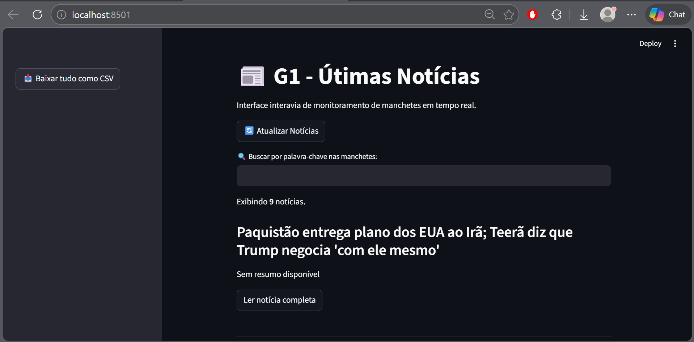

# 📰 G1 News Scraper Interativo

**Status: Concluído / Aplicação Web de Extração de Dados**

Uma aplicação **Full-Stack Python** robusta que transforma dados não estruturados do portal G1 em uma interface visual interativa. O projeto evoluiu de um script de linha de comando para uma ferramenta de monitoramento em tempo real com capacidades de filtragem dinâmica e exportação de dados.



## ⚙️ Funcionalidades

* **Extração Inteligente:** Coleta títulos, resumos e links das manchetes principais utilizando **BeautifulSoup4**.
* **Interface Reativa:** Interface web desenvolvida com **Streamlit**, permitindo busca instantânea por palavras-chave sem recarregar a página.
* **Processamento de Dados:** Utilização de **Pandas** para estruturação, limpeza e filtragem dos dados coletados.
* **Gerenciamento de Performance:** Implementação de **Cache (TTL)** para otimizar requisições e evitar sobrecarga no servidor de origem.
* **Exportação de Dados:** Download direto via interface em formato **CSV** para análises externas.
* **Resiliência:** Tratamento de exceções HTTP, timeouts e variações no DOM para garantir a continuidade da execução.

## 🛠 Tecnologias

* **Linguagem:** Python 3.13
* **Bibliotecas Principais:**
    * **BeautifulSoup4:** Parsing e extração de dados HTML.
    * **Requests:** Comunicação com o protocolo HTTP.
    * **Streamlit:** Framework para criação da interface web interativa.
    * **Pandas:** Manipulação e filtragem eficiente de estruturas de dados.

## 🚀 Como Usar

1. **Clone o repositório:**
```bash
git clone https://github.com/mrfelipesensei/Web_Scraper
cd Web_Scraper
